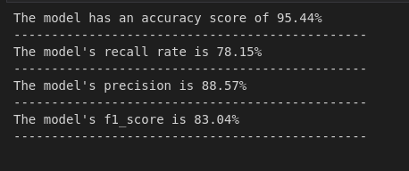
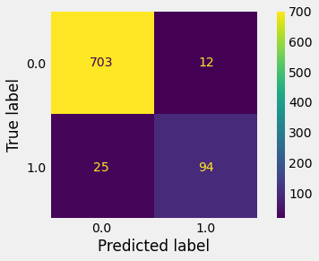
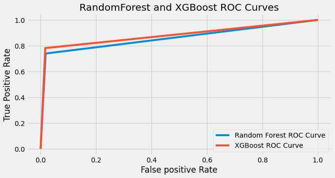

## SYRIA TEL CUSTOMER CHURN


### Business Overview
The company would like to investigate the churn rates to impact decisions on products being offered to the clients and more so decisions on client-based products. Churn rates will also indicate our growth potential and also see the amount of revenue lost due to the unsubscriptions. 

According to forbes, it takes a lot more money (up to five times more) to get new customers than to keep the ones you already have. Churn tells us how many existing customers are leaving the business, so lowering churn will have a big positive impact on our revenue streams.

### Business Problem
The company plans to increase it's revenues through customer retention as we've seen it's cheaper to retain a customer you already have. 

Having this in mind the company wants to learn its clients' patterns and manage to make predictions on customers who are likely to churn for further engagements to be done through tailoring the products enabling the company retain the client and try to maximize it's revenues.

### Objectives
The main objective of this study is to predict churn. Hence the use of machine learning models.

The impact of churn rate is clear and predicting churn would be a good way create proactive marketing campaigns targeted to customers about to churn and also understand customer pain points which would help us improve our products.

### Data Understanding/Sourcing
The data used was sourced from Kaggle. More about the data can be found in [this link](https://www.kaggle.com/datasets/becksddf/churn-in-telecoms-dataset)

The dataset was great as it had exhaustive features about customers'subscriptions and also their average use in terms of spending and time.

### Modelling and Evaluation
I tried out different models including; LogisticRgression, DecisionTreesClassifier, KNeigborsClassifier, RandomForestClassifier and XGBClassifier.

All these model had different outputs but the XGBClassifier seemed to outdo them.
After evaluation the image below shows the evaluation metrics of the XGBClassifier;


The visuals below shows the confusion matrix obtained through the XGBClassifier from the test data;


XGBClassifier had a higher auc (0.8865663748016688) compared to the RandomForest (0.8662572721396251) which also contributed in the decision making process of the better model.


More of the modelling and data preparation can be found in the notebook.ipynb

### Conclusion
After tuning the models I settled with the tuned XGBClassifier as it improved on the recall rate as the main goal is being able to identify the people likely to churn even if it means having more false positives  which won't affect much as we'll still be remarketing to our customers.

The ```optimal values``` are:

{'learning_rate': 0.5,
 'max_depth': 7,
 'min_child_weight': 1,
 'n_jobs': 0,
 'random_state': 20,
 'subsample': 1}
 
 The model has an accuracy of 96%, was able to correctly classify 79% of the churned customers and has a precision of 89% meaning that in every prediction there is a 0.89 probability that it's true.

 Also the model had an auc score of 0.89 making it the better model compared to the RandomClassifier.